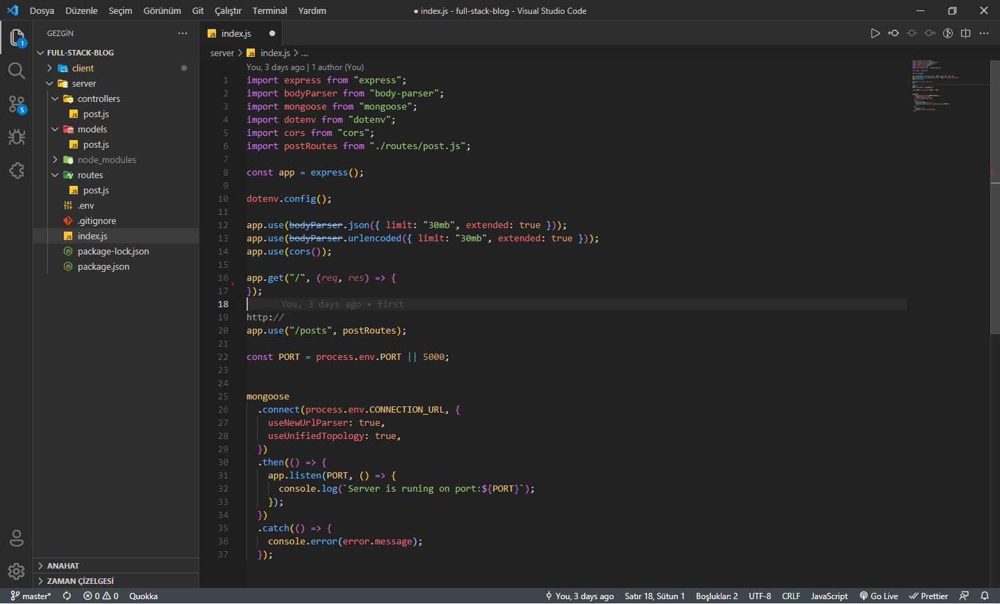
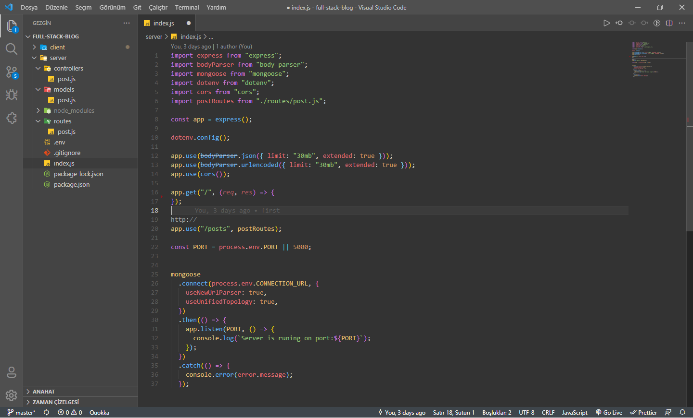

# Infinite Space
## VsCode Themes

### Installation

Clone the repo and move the <code>infiniry-space</code> folder to the <code>%USERPROFILE%\.vscode\extensions</code> directory. Then activate the theme.

### Space Dark

 

### Space Grey

